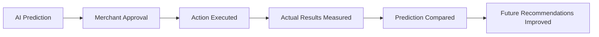
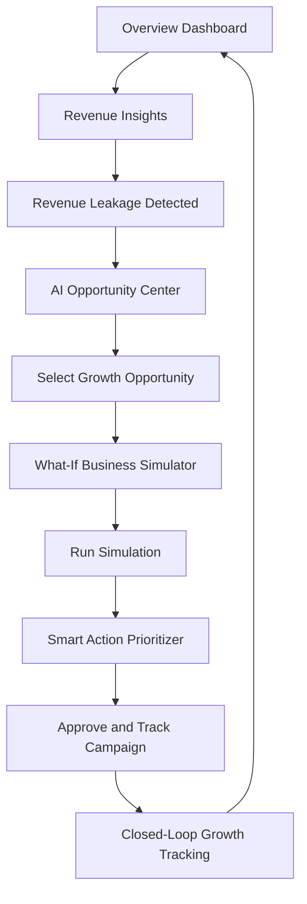
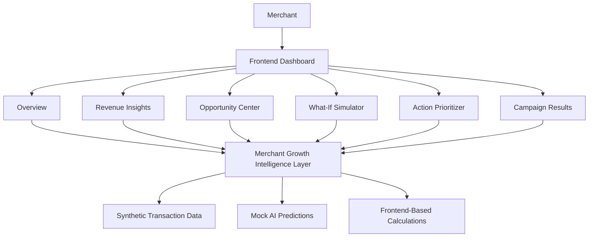
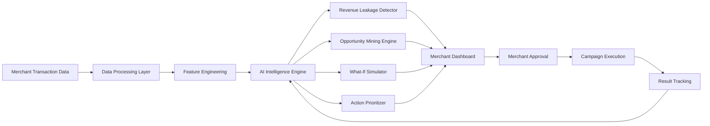
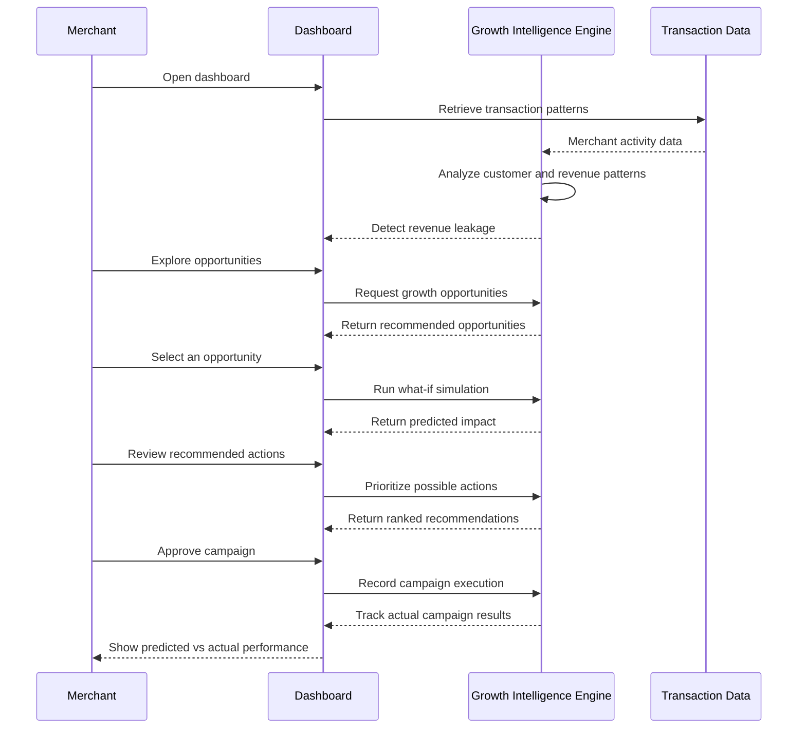

# VyaparMitra AI — Merchant Growth Agent

> An AI-powered merchant growth intelligence platform prototype built for the Paytm Build for India AI Hackathon.

VyaparMitra AI is designed as a merchant growth decision assistant for small and medium-sized businesses.

Instead of only displaying transaction reports, the platform converts business data into actionable insights by helping merchants:

- Detect hidden revenue leakage.
- Discover growth opportunities.
- Simulate business decisions before implementation.
- Prioritize the most valuable actions.
- Track campaign outcomes and improve future recommendations.

---

## 🚀 Live Prototype

**Live Demo:**  
https://vyapar-mitra-ai-merchant-growth-age.vercel.app/

> This is a frontend-based hackathon prototype using synthetic merchant data and simulated AI predictions.

---

## 🎯 Problem Statement

Small merchants generate valuable transaction data through digital payments, but many do not have the time, tools, or expertise to convert that data into meaningful business decisions.

Traditional dashboards usually answer:

> "What happened to my sales?"

However, merchants also need answers to:

- Why are customers returning less frequently?
- Where am I losing potential revenue?
- Which products or services have growth potential?
- Which action should I take first?
- Will a discount campaign actually be profitable?

VyaparMitra AI aims to answer:

> "Why is it happening, what opportunity am I missing, and what should I do next?"

For example, a café owner may have stable overall revenue while repeat customer activity is declining. The platform identifies this pattern, estimates potential revenue at risk, suggests a targeted action, simulates its expected impact, and tracks the final outcome.

---

# 💡 Solution Overview

VyaparMitra AI acts as a merchant growth decision assistant.

The proposed workflow transforms raw transaction data into measurable business actions.

```mermaid
flowchart LR
    A[Merchant Transaction Data] --> B[AI Analysis]

    B --> C[Revenue Leakage Detection]
    B --> D[Growth Opportunity Discovery]

    C --> E[What-If Business Simulation]
    D --> E

    E --> F[Smart Action Prioritization]
    F --> G[Merchant Approval]
    G --> H[Campaign Execution]
    H --> I[Campaign Results]

    I --> J[Future Recommendations Improved]
    J --> B
````

### Core Idea

The platform follows a continuous cycle:

**Detect → Discover → Simulate → Prioritize → Approve → Execute → Track → Learn**

The goal is to transform raw business data into clear and actionable decisions.

---

# 🧠 Core Features

## 1. Revenue Leakage Detector

Identifies hidden revenue loss by analyzing merchant transaction patterns.

### What It Detects

* Declining repeat customer activity.
* Inactive regular customers.
* Reduced purchase frequency.
* Potential revenue at risk.

### Example

```text
Repeat customer rate declined from 86% to 68%.

420 regular customers have not made a purchase
in the last three weeks.

Estimated revenue at risk: ₹18,000 per month.
```

### Prototype Output

The Revenue Insights page displays:

* Repeat customer decline.
* Number of inactive regular customers.
* Estimated monthly revenue at risk.
* Customer retention trends.
* Explanation of why the issue matters.

---

## 2. AI Opportunity Mining

Discovers practical growth opportunities from transaction patterns.

### Example Opportunities

| Opportunity                  | Insight                                                        |
| ---------------------------- | -------------------------------------------------------------- |
| Recover Inactive Customers   | Re-engage regular customers who have stopped purchasing.       |
| Evening Coffee + Snack Combo | Coffee sales are high, but snack purchases are low.            |
| Improve Slow Business Hours  | Identify underperforming time periods for targeted promotions. |

Each opportunity includes:

* Target customer or business segment.
* Potential revenue impact.
* Confidence level.
* Estimated implementation effort.

---

## 3. What-If Business Simulator

Allows merchants to test a business decision before implementing it.

Instead of immediately spending money on a campaign, the merchant can evaluate possible outcomes first.

### Simulation Inputs

* Customer segment.
* Action type.
* Discount percentage.
* Campaign duration.

### Simulation Outputs

* Expected customers recovered.
* Estimated additional revenue.
* Campaign cost.
* Expected profit impact.
* Risk level.

### Example

```text
Customer Segment:
Inactive Regular Customers

Action:
Retention Discount

Discount:
10%

Campaign Duration:
7 Days

Expected Customers Recovered:
120–150

Estimated Additional Revenue:
₹18,000

Campaign Cost:
₹4,500

Expected Profit Impact:
Positive
```

The simulator helps merchants evaluate decisions before execution.

---

## 4. Smart Action Prioritizer

Ranks possible business actions according to their expected value.

The prioritization logic considers:

* Expected revenue impact.
* Urgency.
* Implementation effort.
* Confidence.
* Risk.

### Example

| Priority | Action                          | Expected Impact | Reason                           |
| -------- | ------------------------------- | --------------: | -------------------------------- |
| High     | Launch targeted retention offer |         ₹18,000 | High confidence, low effort      |
| Medium   | Evening combo promotion         |         ₹10,000 | Promising cross-sell opportunity |
| Low      | Promote slow-moving products    |          ₹4,000 | Lower urgency                    |

The purpose is to answer:

> "What should the merchant do first?"

---

## 5. Closed-Loop Growth Tracking

Measures what happens after a merchant takes an action.

The platform compares predicted results with actual campaign performance.



### Example Campaign Result

```text
Campaign:
10% Retention Offer

Predicted Customers Recovered:
120–150

Actual Customers Recovered:
138

Predicted Revenue:
₹18,000

Actual Additional Revenue:
₹16,500

Prediction Accuracy:
92%

Campaign Status:
Successful
```

This creates a feedback loop instead of generating one-time recommendations.

---

# 🖥️ Prototype Workflow

The prototype demonstrates one complete merchant growth journey.



---

# 📊 Prototype Screens

## Overview Dashboard

Provides a high-level summary of merchant performance.

### Displays

* Total revenue.
* Revenue growth.
* Repeat customer percentage.
* Revenue at risk.
* Revenue trend.
* Customer retention.
* AI-detected business issues.
* Top AI recommendation.

### Purpose

To provide one clear view of:

**Performance → Risk → Next Best Action**

---

## Revenue Insights

The Revenue Leakage Detector identifies a decline in repeat customer activity.

The page explains:

* What is happening.
* Why it matters.
* Estimated financial impact.
* Customer retention trends.

The merchant can continue directly to growth opportunities.

---

## Opportunities

The AI Opportunity Center converts transaction patterns into actionable growth ideas.

The merchant can explore:

* Customer recovery opportunities.
* Product combinations.
* Slow business hours.
* Potential revenue.
* Confidence and effort estimates.

---

## What-If Simulator

The merchant selects a business action and adjusts campaign parameters.

The prototype displays:

* Expected customer recovery.
* Additional revenue.
* Campaign cost.
* Profit impact.
* Risk level.

---

## Recommended Actions

The Smart Action Prioritizer organizes business decisions into High, Medium, and Low priority.

The page recommends the action with the strongest combination of impact, urgency, effort, and confidence.

The merchant must approve the action before campaign tracking begins.

---

## Campaign Results

The Closed-Loop Growth Tracking page compares predicted and actual campaign performance.

It demonstrates how campaign outcomes can be used as feedback to improve future recommendations.

---

# 🏗️ System Architecture

## Current Prototype Architecture

The current version is a frontend-based demonstration of the proposed platform.

It uses synthetic merchant transaction data, mock AI insights, simulated calculations, and a frontend dashboard.



---

# 🏭 Proposed Production Architecture

The following architecture represents how the prototype could be extended into a production-ready merchant intelligence platform.



### Proposed Production Components

| Layer                     | Responsibility                                                    |
| ------------------------- | ----------------------------------------------------------------- |
| Data Processing Layer     | Clean and prepare merchant transaction data.                      |
| Feature Engineering       | Generate customer, revenue, product, and time-based features.     |
| AI Intelligence Engine    | Analyze patterns and generate insights.                           |
| Revenue Leakage Detector  | Identify declining activity and potential revenue loss.           |
| Opportunity Mining Engine | Discover customer, product, and time-based opportunities.         |
| What-If Simulator         | Estimate possible outcomes of business decisions.                 |
| Action Prioritizer        | Rank actions using impact, effort, urgency, confidence, and risk. |
| Merchant Dashboard        | Present insights and recommended actions.                         |
| Result Tracking           | Compare predictions with actual outcomes.                         |

---

# 🔄 End-to-End Product Logic



---

# 🛠️ Technology Stack

## Frontend

* HTML5
* CSS3
* JavaScript

## Prototype Data

* Synthetic merchant transaction data.
* Mock AI insights.
* Simulated predictions.
* Frontend-based calculations.

## Deployment

* Vercel

## Version Control

* GitHub


---

# 🧪 Demo Scenario

The prototype uses a fictional café merchant named Aarav Café.

### Scenario Flow

1. The merchant opens the Overview Dashboard.
2. The system monitors overall revenue and customer activity.
3. AI detects that repeat customer activity has declined.
4. The system identifies 420 inactive regular customers.
5. Estimated revenue at risk is ₹18,000 per month.
6. The AI suggests a targeted retention offer.
7. The merchant opens the What-If Simulator.
8. A 10% discount for seven days is tested.
9. The system predicts a positive revenue impact.
10. The action is ranked as the highest-priority recommendation.
11. The merchant approves the campaign.
12. Actual results are compared with predictions.
13. The result becomes a learning signal for future recommendations.

---

# 🎯 Target Users

The initial concept focuses on small and medium-sized merchants, including:

* Cafés.
* Restaurants.
* Retail stores.
* Salons.
* Local service businesses.

For the hackathon demonstration, the primary example is a café merchant because customer retention, product combinations, and business-hour patterns can be easily demonstrated using transaction data.

---

# 🌟 Key Differentiator

Traditional merchant dashboards mainly report historical performance.

VyaparMitra AI is designed to move beyond reporting by connecting insights with decisions and measurable outcomes.

| Traditional Dashboard    | VyaparMitra AI               |
| ------------------------ | ---------------------------- |
| Shows what happened      | Explains what is happening   |
| Displays reports         | Detects hidden problems      |
| Provides data            | Finds growth opportunities   |
| Requires manual analysis | Suggests business actions    |
| Shows historical results | Simulates possible decisions |
| One-time insights        | Closed-loop learning         |

### Core Value Proposition

> Turning merchant transaction data into the next best business action.

---

# ⚠️ Prototype Disclaimer

This repository contains a hackathon prototype and product demonstration.

The current version uses:

* Synthetic merchant data.
* Mock AI insights.
* Simulated predictions.
* Frontend-based calculations.

It does not currently connect to real Paytm merchant production data or execute live campaigns.

The prototype demonstrates the proposed user experience, product workflow, and solution architecture.

---

# 🔮 Future Scope

The prototype can be extended into a production-ready merchant intelligence platform.

Possible future improvements include:

* Secure integration with merchant transaction APIs.
* Real-time transaction data processing.
* Machine learning-based customer segmentation.
* Revenue forecasting models.
* Product recommendation models.
* Campaign automation with merchant approval.
* Advanced profit and risk prediction.
* Explainable AI recommendations.
* Multi-merchant benchmarking.
* Role-based authentication and analytics.

---

# 👩‍💻 Team

**Project:** VyaparMitra AI — Merchant Growth Agent
**Event:** Paytm Build for India AI Hackathon
**Track:** Merchant Growth AI

---

## ⭐ Note

This project is an early-stage prototype focused on demonstrating the product idea, user workflow, and proposed AI-driven architecture for merchant growth intelligence.

